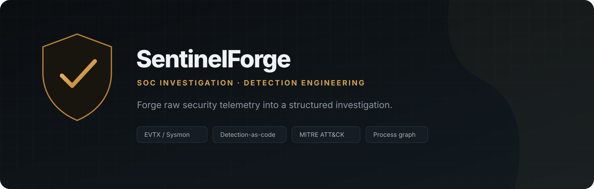
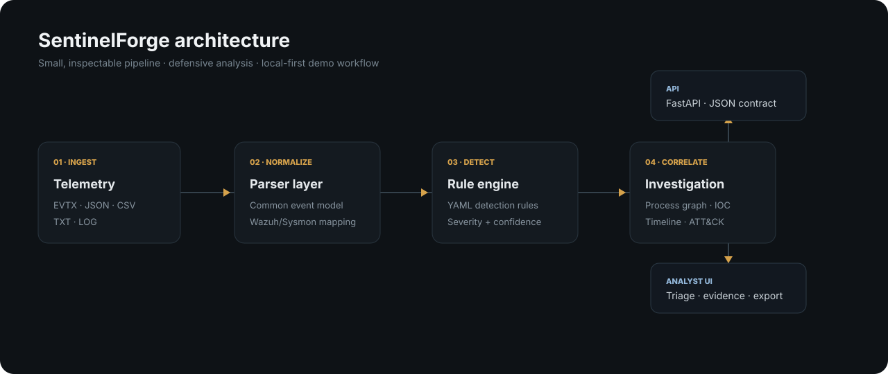

<p align="center">
  
</p>

<p align="center">
  <strong>Defensive SOC investigation + detection engineering workbench.</strong><br/>
  Normalize telemetry, evaluate YAML detections, correlate process activity, extract IOCs, and review MITRE ATT&CK coverage.
</p>

<p align="center">
  
  
  
  
</p>

> **Release:** `v0.2.0 — Telemetry Engine`  
> SentinelForge is a portfolio/open-source defensive security project. It is not a SIEM replacement and does not claim full Sigma compatibility.

## Why SentinelForge exists

SOC portfolios often say *“I know Sysmon, Wazuh, MITRE ATT&CK and incident investigation.”* SentinelForge turns those claims into an inspectable project: parsers, a normalized event model, detection rules, correlation logic, tests, CI, a CLI, an API, and an analyst-facing interface.

### What v0.2 adds

- **Windows `.evtx` ingestion** through `python-evtx`
- **Wazuh/Sysmon-friendly normalization** into a common event schema
- **External YAML detection rules** instead of Python-hardcoded matches
- 12 curated defensive detections with current MITRE ATT&CK mappings
- Severity **and confidence-aware** risk scoring
- IOC extraction for URLs, domains, email, IPv4, MD5, SHA-1, SHA-256
- PID/PPID **process graph correlation**
- ATT&CK technique hit summary
- `/api/rules` detection inventory
- CLI analysis + JSON export
- Hardened container baseline and response security headers
- Multi-version CI, Ruff linting, tests, Dependabot
- Redesigned analyst workspace with drag/drop, filters and export

## Demo investigation

Run the service, click **Load demo**, then **Run analysis**. The bundled synthetic dataset models a suspicious document → PowerShell → download → child process → scheduled task/defense-tampering chain.

```text
WINWORD.EXE (PID 4080)
└── powershell.exe (PID 5116)
    └── agent.exe (PID 6240)
        ├── schtasks.exe (PID 6352)
        └── powershell.exe (PID 6404)
```

The dataset is synthetic and uses documentation-only domains/IP ranges.

## Quick start

### Python

```bash
git clone https://github.com/ShalvaLekishvili/SentinelForge.git
cd SentinelForge
python3 -m venv .venv
source .venv/bin/activate
python -m pip install -r requirements-dev.txt
make dev
```

Open `http://127.0.0.1:8000`.

### Docker

```bash
docker compose up --build
```

### CLI

```bash
python -m backend.cli sample-data/demo-incident.json --output investigation.json
```

## Architecture

<p align="center">
  
</p>

```text
Telemetry
   │
   ├── EVTX parser
   ├── JSON / Wazuh parser
   ├── CSV parser
   └── line-oriented parser
          │
          ▼
NormalizedEvent
          │
          ├── YAML detection engine ──► findings + MITRE mappings
          ├── IOC extractor          ──► indicators
          ├── PID/PPID correlation  ──► process graph
          └── scoring               ──► risk summary
                                      │
                                      ▼
                              FastAPI / Analyst UI / CLI
```

See [`docs/ARCHITECTURE.md`](docs/ARCHITECTURE.md) for design details.

## Detection library

Rules live in [`rules/`](rules/) and are intentionally **Sigma-inspired**: metadata, log source context, detection clauses, condition logic, and ATT&CK mappings are separate from Python code.

| Rule | Detection | Severity | ATT&CK |
|---|---|---:|---|
| SF-EXEC-001 | Encoded PowerShell | High | T1059.001 |
| SF-EXEC-002 | Office → PowerShell | High | T1204.002, T1059.001 |
| SF-PERS-001 | Registry Run/RunOnce | Medium | T1547.001 |
| SF-PERS-002 | Scheduled Task creation | Medium | T1053.005 |
| SF-CRED-001 | Potential LSASS memory dump | Critical | T1003.001 |
| SF-DEF-001 | Defender real-time monitoring tampering | High | T1562.001 |
| SF-TRANSFER-001 | PowerShell remote file transfer | High | T1105, T1059.001 |
| SF-LOLBIN-001 | Rundll32 suspicious proxy execution | High | T1218.011 |
| SF-LOLBIN-002 | Regsvr32 remote scriptlet pattern | High | T1218.010 |
| SF-LOLBIN-003 | Mshta remote/script execution | High | T1218.005 |
| SF-PERS-003 | Service creation via `sc.exe` | Medium | T1543.003 |
| SF-NET-001 | PowerShell with destination IP | Medium | T1059.001 |

Read [`docs/RULE_AUTHORING.md`](docs/RULE_AUTHORING.md) before adding detections.

## API

| Endpoint | Method | Purpose |
|---|---|---|
| `/api/health` | GET | Service version + active rule count |
| `/api/rules` | GET | Detection rule inventory |
| `/api/analyze` | POST | Analyze EVTX/JSON/CSV/TXT/LOG telemetry |
| `/docs` | GET | OpenAPI / Swagger UI |

## Repository map

```text
backend/
  parsers/            EVTX + structured/text parsers and normalization
  services/           detection, IOC, scoring, correlation, analysis
  cli.py              terminal analysis entry point
frontend/              dependency-free analyst UI
rules/                 external YAML detection-as-code library
sample-data/           synthetic investigation datasets
tests/                 parser, engine, API, correlation, scoring tests
docs/                  architecture, rules, roadmap, demo notes
assets/                README visual assets
.github/               CI, Dependabot, issue templates
scripts/               GitHub Project bootstrap helper
```

## Engineering principles

1. **Explainable detections** — every hit carries rule, evidence, severity, confidence and ATT&CK context.
2. **Small core** — avoid hiding core investigation logic behind a heavy framework.
3. **Portable telemetry** — normalize multiple source shapes before detection.
4. **Detection-as-code** — rules are reviewable data files with tests.
5. **Synthetic-by-default** — public demos must not expose real incident artifacts.
6. **Defensive scope** — analysis and detection capabilities, not exploitation automation.

## Development

```bash
make install
make lint
make test
```

GitHub Actions runs lint + tests across supported Python versions. Pull requests that add detection rules should include a positive test/sample and document expected false positives.

## Roadmap

- **v0.3** — richer Sysmon Event ID semantics, field aliases, investigation search, rule tests
- **v0.5** — persisted cases, analyst notes, evidence tagging, timeline filters
- **v0.7** — Sigma import/validation experiment, Wazuh adapter, HTML report export
- **v1.0** — stable schema, release docs, larger synthetic investigation pack

Full plan: [`docs/ROADMAP.md`](docs/ROADMAP.md).

## Security & privacy

Do not upload sensitive production logs to public demos. SentinelForge does not need outbound internet access for its core analysis path. See [`SECURITY.md`](SECURITY.md).

## License

MIT © 2026 Shalva Lekishvili
